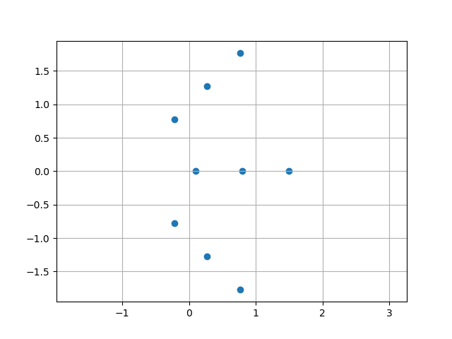

# Auto_Docking_Aruco

## Dependancy

No external library needed for auto-docking function

Run with *aruco detection* package and *robot base driver/simulation* 

## How to use

1. Import *Docking_OOP.py*
2. Create Dock_Robot object with x and y offset of camera
3. Run object.Start_Docking

### Example

```py
import Docking_OOP

if __name__=='__main__':
    rospy.init_node('docking_controller')
    x_offset=rospy.get_param("/x_offset")#use ROS_param to configure offsets...
    y_offset=rospy.get_param("/y_offset")
    TARS4=Docking_OOP.Dock_Robot(x_offset,y_offset)
    #or dont ¯\_(ツ)_/¯
    #TARS4=Dock_Robot(0.22,0) #x_offset,y_offset
    TARS4.Start_Docking()
```

Please see documentation for more information and modification.

## gimme_mah_points

Basic script to generate 9 testing points within specified angle and radius from the tag.

### Example

```py
import gimme_mah_points

if __name__=='__main__':
    rospy.init_node('test_points_generator')
    test1=gimme_mah_points.Test_Points(90,1.1,2.5,1)#max angle,minimum distance,maximum distance,robot offset from tag when parked
    print(test1.driving_instructions)
    print(test1.turning_instructions)
    #gives the turning angle and travel distance to reach each test points
    #-----------------------------------------------------------------
    test1.carti_points#gives the cartisian(x,y) coordinates of the test points
    test1.polar_points#gives the polar(r,theta) coordinates of the test points
```



## dock_test_auto

Script to automate testing using *Docking_OOP.py* and *gimme_mah_points.py* to dock and generate test points of different radius and angle from the tag. Results are then recorded in *data.csv*.

## Misc notes

- Failed test includes dubin path approach to the same problem but seems to perform worst than the turn-move-turn approach in both simulation and hardware
- Docking_OOP.cpp is the same as Docking_OOP.py functionally but does not seem to work due to how ROS and OOP interacts in C++. Might be fixed in the future but not now.
